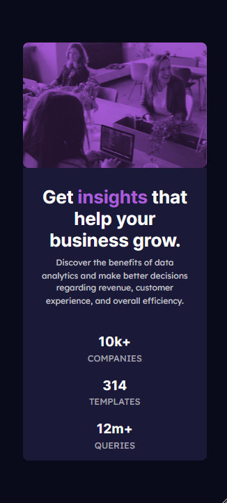

# Front-End Mentor Challenge

# Stats Preview Card

Projeto totalmente responsivo voltado a otimizar e treinar as tecnologias de Desenvolvimento Web Front-End.

## Tecnologias e Métodos utilizados.

<ul>
    <li><b>HTML</b></li>
    <li><b>CSS</b></li>
    <li><b>SCSS</b></li>
</ul>

Para visualizar a Lading Page, basta clicar <a href="https://thejrodrigues.github.io/Stats-preview-card/" target="_blank" alt="Link do Site">Aqui</a>

Abaixo consta algumas imagens da página, sendo elas da estilização para Mobile e para Desktop.

# Mobile

  
  

# Desktop

